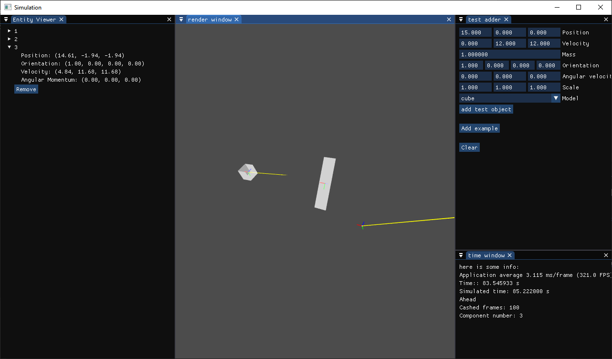

# Rocket simulation
Code that simulates rigid bodies.<br>
Rendering is done using OpenGL with Dear ImGui.

Units: SI<br>



### Building and running
The project uses CMake and requires C++23 or later.
>Only tested building on Windows 10 with MSVC and Clang so results on other platforms may vary.
1. Clone the repository and submodules
    ```bash
    git clone --recursive https://github.com/Lokestrom/rocketSim-code
    ```
    >Forgot to use --recursive just run: `git submodule update --init --recursive`

2. Build using CMake (version 4.1 or later)<br>
    ```bash
    cd rocketSim-code
    cmake -S . -B build # create build files
    cmake --build build --config <configuration> # Debug or Release
    ```

3. Run the program<br>
    ```bash
    build/<configuration>/app # Debug or Release
    ```

### Using
1. Click **"new simulation"** then **"create"** in the popup (ignore the text input not in use currently).
2. Now 3 windows will open (they may be small, just expand them as needed). 
3. In the Test Adder window, you can:
    * Add an example with a rotating cuboid and a small sphere orbiting, or
    * add your own rigid body.
>The simulation uses Newton's Law of Universal Gravitation, integrated using fourth-order Runge–Kutta (RK4).

NOTE:
* When adding rigid bodies it takes some time before they appear. This is do to the simulation running in a separate thread. I have plans on a rework of the cache system to make it more responsive and enable saving/loading of simulations.
* If you want more responsive adding of bodies you can go to the [`Simulation/Simulation/RenderingCache.hpp`](Simulation\Simulation\RenderingCache.hpp) file and change the `std::atomic<unsigned int> _maxFrames` at the end of the class and file to 1 (currently set to 100). This can cause some stuttering in the rendering and a performance loss in the simulation.
#### Vulkan supported version:
To use the Vulkan version, check out the following commit:
``` bash 
git checkout 6084fc72a0f7616009d146f76b29d1b6b456b0c9
```
[View on GitHub](https://github.com/Lokestrom/rocketSim-code/tree/6084fc72a0f7616009d146f76b29d1b6b456b0c9)<br>
